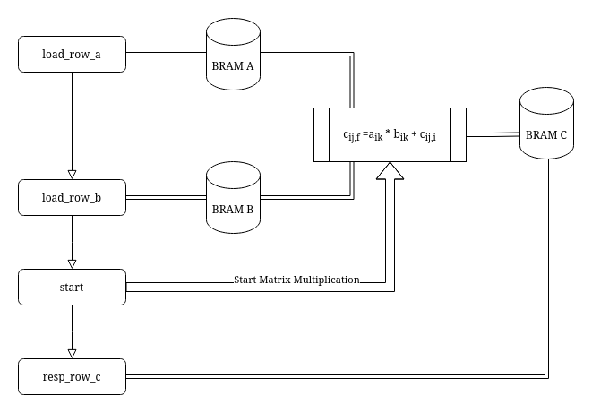

# Matrix Multiplication Lab

## Setup

Clone your private repo by clicking on the green button that says "code". Next click on SSH. Copy the ssh address. Now call `git clone git@github.com:6192-sp24/lab1-b-matrix-multiplication-<your github account name>.git`. You can paste the latter part of the command instead of typing it out, but it should be the same. Now `cd lab1-b-matrix-multiplication-<your github account name>/` into the cloned directory to start working on the lab.

## The Scenario

Tim the Beaver has fallen into the craze of computer vision and machine learning after borrowing his friend's brand new augmented reality headset
over the weekend. Once he's done trying it out, his friend tells him about the high tech hardware specifications of the headset. He then learns that the
developers of the headset designed a custom spatial computing chip for the device. He then questions his friend about why they put the time and
effort into designing a new custom chip instead of using a general x86 processor. His friend suggests that maybe spatial computing is easier to
do in hardware than software. Let's find out!

## Hardware Specification

```
interface MM;
    method Action write_row_a(Vector#(16, Bit#(32)) row, Bit#(4) row_idx);
    method Action write_row_b(Vector#(16, Bit#(32)) row, Bit#(4) row_idx);
    method Action start();
    method ActionValue#(Vector#(16, Bit#(32))) resp_row_c();
endinterface
```

To find out if hardware design is easier than software for spatial computing, you decide to design your own chip for spatial computation that can compute 16x16 matrix 
multiplication ($C = A * B$) with 32-bit integer elements. To simulate the spatial computing chip, your chip needs to perform many matrix multiplications. You decide to encapsulate the matrix multiplication logic in a module mkMatrixMultiplyFolded that implements the above interface MM. You will need to implement this module.

The module mkMatrixMultiplyFolded is instantiated inside your chip, and the chip can send and receive data from the module using its method calls. When the chip wants to do a matrix multiplication operation ($C = A * B$), it needs to first load the data into the module for the $A$ and $B$ matrices. It's impractical to load in all 16x16 32-bit values from the chip at once, so the chip writes in the data one row at a time. The chip will attempt to call methods `write_row_a` and `write_row_b` with the $A$ and $B$ matrices' data for each row until all the data is fed into the module. Once all the data is fed in, the chip will call `start `to initiate the matrix multiplication. After the chip starts the calculation, it will attempt to read the response using `resp_row_c`, which returns each row of the matrix product ($C$) one at a time. It will continue calling `resp_row_c` until the chip has collected all the rows (0-15). The module will need to use BRAMs to store the large amount of data for each matrix; BRAM $A$ and BRAM $B$ for the input matrices' data and BRAM $C$ for the output matrix data.

The rest of your chip doesn't know how your module is implemented, so it will attempt to call the interface methods as soon as the outer logic is ready (which is likely sooner than the internal calculation logic will finish). You should use what you learned about guards to ensure that the module doesn't accept any interface method calls that the module isn't ready for.

## Summary

- Method `write_row_a` must write each element of the 16 elements of size 32 bits Vector `row` into the row specified by `row_idx` within BRAM $A$.
  - For example, if `write_row_a` is called with arguments `row` = [0,1,2,3,4,5,6,7,8,9,10,11,12,13,14,15] and `row_idx` = 5, then all of the
elements of `row` should be written to BRAM $A$. All of the address(es) should correspond to the 6th row of the matrix.
Note: There is more than one way to design and address the BRAMs  (More on this later).
- Method `write_row_b` must do the same for BRAM B.
- Method `start()` should start the matrix multiplication calculation. The guard of `write_row_a`, `write_row_b`, and `resp_row_c` should be false 
while calculating matrix $C$.
- Method `resp_row_c` should return 1 row of matrix $C$. On the first call, it should return the first row and on the second call, it should return
the second row.

## Design Notes

- You may use the * operator to perform scalar multiplications, so there is no need to implement your own multiplier. Bluespec will instantiate a multiplier where you place the *. Because multipliers are expensive, you should not instantiate more than one.
- Ignore integer overflow in your design
- To debug your code, we *highly* recommend using `$display();` statements throughout your code. `display();` functions similarly to `printf();`. Eg. `display("1+2=%d", 3);`.
- You may want to define an enum using a typedef enum for your module's states.
- You may want to write out the procedure for matrix multiplication in pseudocode [though spoilers that it might be easier to write in software]
- We recommend calculating matrix $C$ by iterating over the elements of $A$ & $B$. In other words, each cycle of your $C$ matrix calculation rule should compute the value: $$c_{ij,f}
= a_{ik} * b_{kj} + c_{ij,i}$$ **INSTEAD OF:** $$c_{ij} =\sum_{k=1}^n a_{ik} * b_{kj}$$

**How many cycles would this take for an NxN matrix and why do we suggest taking this approach?**

The following diagram summarizes the specifications of the hardware design:


## BRAM Design & Usage

There is more than one correct way to design the BRAM to store the values elements of the matrices. First, consider how large the BRAM must be to store all
of the elements of a 16x16 32-bit element matrix. **How might you design the layout of the BRAM (input/output size vs address size)? What are the pros and cons of each design?**


How to initialize a BRAM module:

```
BRAM_Configure cfg = defaultValue;
BRAM1Port#(Bit#(addrSize), Bit#(dataSize)) a <- mkBRAM1Server(cfg);
```

How to send a request to a BRAM:

```
a.portA.request.put(BRAMRequest{write: True, // False for read
                         responseOnWrite: False,
                         address: _,
                         datain: _});
```

How to read a response from a BRAM:

```
let resp <- a.portA.response.get();
```

## Design Verification

To verify your design call `make` on your command line. It should automatically re-compile your design if there are updates and
save the testbench output to the file `output.log`. It will also create a `mkTb.sched` file that you can inspect for the scheduling
information we learned about in Lecture 3.

There are 4 tests performed in sequence:
- test0: Multiply the identity matrix with itself
- test1: Again multiply the identity matrix with itself
- test2: Multiply two random matrices
- test3: Multiply two other random matrices

## Submission

To submit your completed lab we ask that you stage, commit, and push your changes to your repo. **Please include your entire working directory, including the output files, in your submission.**

To do this you should only need to call `make submit`. After doing so, your entire directory should be uploaded to your private git-repo on Github Classroom. Upon submission,
Github will automatically test & verify that your design runs correctly. You should see a green checkmark next to the commit titled "Save Changes & Submit" if your design passes Github's testcase. A yellow circle means the test is still pending and a red cross means the test failed. If your design passes locally, but not on Github, let the course staff know as this should not happen.

Please take some time to fill out the [feedback form](https://docs.google.com/forms/d/e/1FAIpQLSeZod3klveOl0EwD17ihhO6dR1eZr4uX2uIyL_9RGUEtsxEiw/viewform?usp=sf_link). We really appreciate it!

Should you need more guidance with git, please contact the course staff or see our piazza post: https://piazza.com/class/lrgt0dgrtpz590/post/27.
