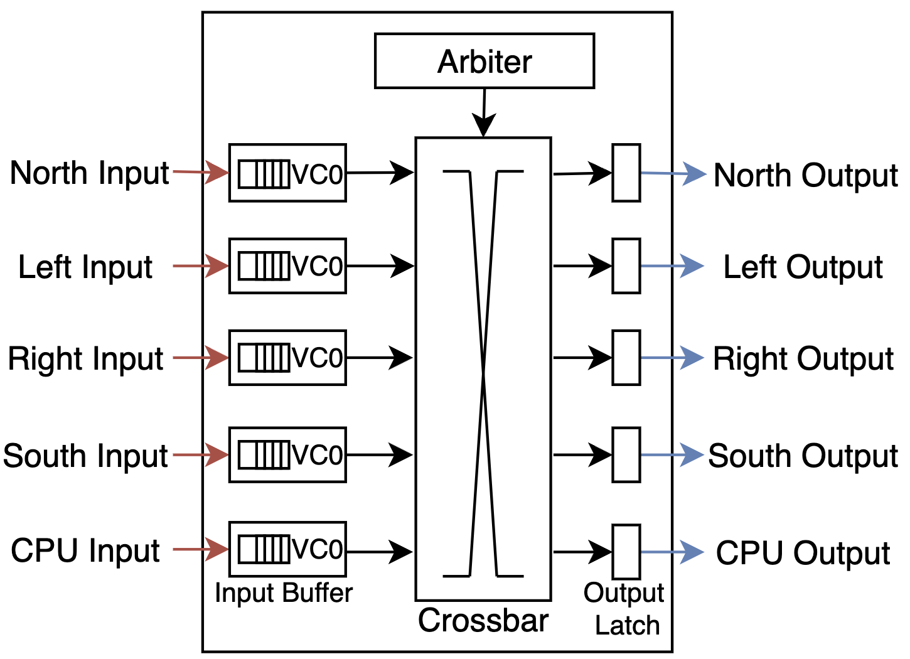
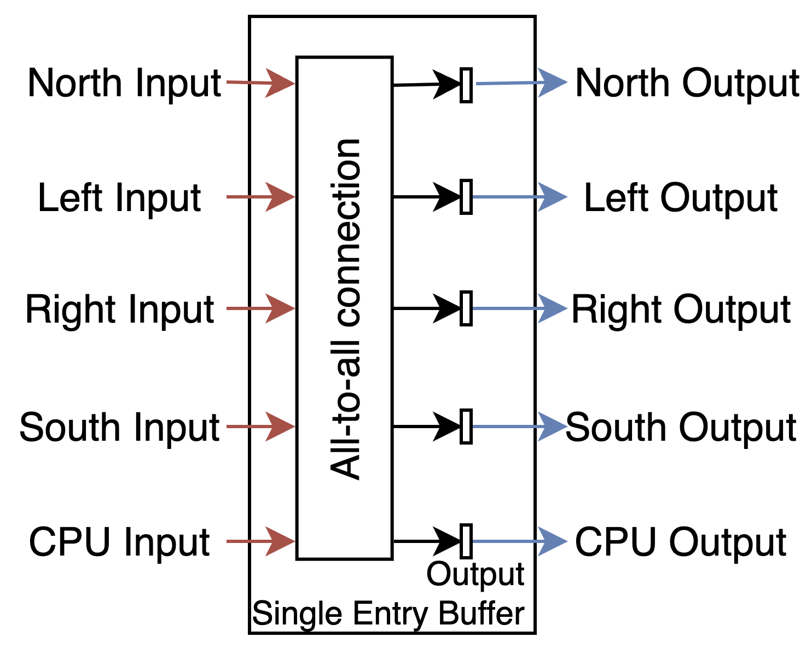
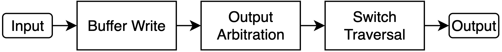

# Lab5: Network-on-Chip Router Lab

In this lab, you will be implementing several components of a network-on-chip (NoC) router to make it fully functional. It includes two parts 

- Part A: crossbar.
- Part B: single-cycle three-stage router.

### Running tests

```bash
make clean
make all
# For part a;
./CrossbarTestBench
# For part b;
./RouterTestBench
```

# Router Overview

Networks-on-chip form the backbone of multi/many-core chips today. NoCs comprise of links, interconnected via routers. Routers enable multiplexing of flits from different packets over the shared links cycle-by cycle. A mesh NoC with routers and links is shown below.

<!--  -->


The router of “Router” in the system 

A router is functionally capable of receiving packets on its input ports, determining the output port based on the routing algorithm, and then forwarding packets to the appropriate output port. Contention for the same output port is resolved using arbiters. 

An overview of the simple router is shown below.

<!--  -->


Router Architecture Overview

The router comprises the following key components

1. **Input/output ports:** In this lab, we are designing the red router that is going to be deployed in a 2D mesh layout of 9 CPUs (as shown in the figure above). The router has 5 input ports, including north, west, east, south and one input from the CPU. 
2. **Input Buffer:** Each input port has an input buffer, which has a FIFO queue to hold the data received from input port.
3. **Arbiter:** When multiple flits from different input ports are requesting the same output port at the same time, an arbiter will select the input with the higher priority to go through while keeping others waiting in the queue.
4. **Crossbar Switch:** The crossbar switch enables arbitrary all-to-all connection from the input to the output.
5. **Flow-Control:** Each input buffer has a finite size. Information about available buffer space is sent via ``backpressure" signals. In this lab, we assume each outer adopts the most simple on/off flow control. If the downstream router has available space to hold new incoming flits, it sends an ``ON" signal, else it sends an ``OFF" signal. A router is allowed to transmit only if the input port at the neighboring router is currently in the ``ON" state.

The red router shown above works in the following steps:

1. The router receives flits from its input ports and stores them inside the corresponding Input buffers.
2. The arbiter collects requests from all inputs and grants the input with the highest priority to pass through crossbar switch. Other inputs without a grant need to wait for the next round of the arbitration in the next cycle.
3. The granted input data will traverse the crossbar, reach the output port and exit the router. 

# Message Type

The minimal data unit being transferred inside router is termed as `flit` , for which we have already provided the implementations inside the `MessageTypes.bsv`. A flit consists of the following fields.

```bash
// We define this flit type in MessagesTypes.bsv

  typedef struct {
    Direction nextDir;    // Used for arbitration
    FlitData  flitData;   // The actual data.
  } Flit deriving (Bits, Eq);
```

where the `nextDir` records the target output port of this incoming input flit and the `flitData` records the actual incoming data of the flits.

The `Direction` consists of the following 5 possibilities

```bash
/* 1. Direction bits */
typedef Bit#(NumPorts) Direction;

Direction north_ = 5'b00001; // North
Direction east_  = 5'b00010; // East 
Direction south_ = 5'b00100; // South
Direction west_  = 5'b01000; // North
Direction local_ = 5'b10000; // Local
Direction null_  = 5'b00000; // It needs to be all zero due to Switch Alloc Unit Logic
```

# Part A — Implement a Crossbar

A crossbar is a switch enabling an input port to connect to an output port. It enables concurrent transmission from all input ports to all output ports as long as no two input ports are sending to the same output port.

In this lab, we will construct a crossbar with 5 input ports and 5 output ports. Each output port has a single entry output buffer. 

<!--  -->


Crossbar Overview

Crossbar supports all input to all output mapping in the same cycle, and we test its functionality based on that.

| direction | index |
| --- | --- |
| North | 0 |
| East | 1 |
| South | 2 |
| West | 3 |
| Local (CPU) | 4 |

Tips: we recommend implementing the input/output ports as a vector of interface with the template implementation shown below.

```bash
interface CrossbarPort;
  method Action putFlit(Flit traverseFlit, DirIdx destDirn);
  method ActionValue#(Flit) getFlit; 
endinterface

interface CrossbarSwitch;
  interface Vector#(NumPorts, CrossbarPort) crossbarPorts;
endinterface
```

# Part B: Implement the Router

### Router Pipeline Overview

In the part B, we will implement a single-cycle router with three-stages, i.e. the router takes only one cycle to route input flits to the output port. 

The three stages that we will implement in part B are shown below.

<!--  -->


Single-cycle Three-stage Router Pipeline Overview

- In **Buffer Write**, the router will write received input flits into the input buffer. Note that the input buffer has a fixed size, such that a router needs to maintain ON/OFF flow control to tell upstream router whether the input buffer of current router has space to hold new flits. Each input ports has its own input buffer.
- **Output Arbitration:** A router has multiple input ports. If multiple flits want to go to the same output port, they have to go out serially. This is implemented via output arbiters which decide the priority order of flits from multiple input ports. Note that each output port has an independent output arbiter, i.e. the router that we will implement in this lab consists of 5 ports and thus there are 5 output arbiters in total. Every cycle, each output arbiter takes 1 bit from each input port, i.e. 5 bits in total from all input ports. Each bit indicates whether this input port has valid flit targeting this output port (i.e., *request*). If there is only a single bit being set within these 5 bits, then it means only 1 input port has received a valid flit targeting this output port and no competition happens. Therefore, the arbiter could directly grant such flit to traverse. Otherwise, if multiple bits within the 5 bits are set as high, then it means competition happens such that the arbiter needs to select only one valid flit to traverse (i.e., *grant*) and keep the other flits on hold for future arbitration.
- **Switch Traversal:** This stage will read the flits being granted in the output arbitration stage to enter the crossbar, and then the crossbar will route the input flit to its target output port. From there it will proceed to the output link in the next cycle.

### Implementation Checklist

<!--  -->


Router MicroArchitecture Overview

In this lab, we provide skeleton code inside `router.bsv`, and you will implement the following key components of the router

- Three stages: Buffer Write, Output Arbitration, Switch Traversal
    - For output arbitration, the arbiter itself is provided.
    - For switch traversal, you will reuse the crossbar you implemented in Part A
- On/Off flow control: we already give the implementation of input buffers, where each input buffer is being implemented as the form of `SizedBypassFIFOF` with 4 available slots. You will need to disable new flits from coming in when the input buffer is full.

Have fun! Enjoy XD

# Submitting

Please run `make submit`. Please remember to use Github to back up your code regularly.

Due: Thursday, April 11, 2024 at 9:30am.
